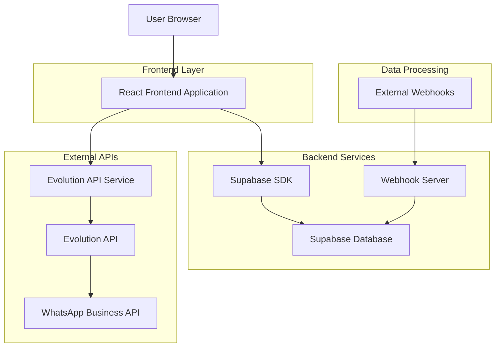
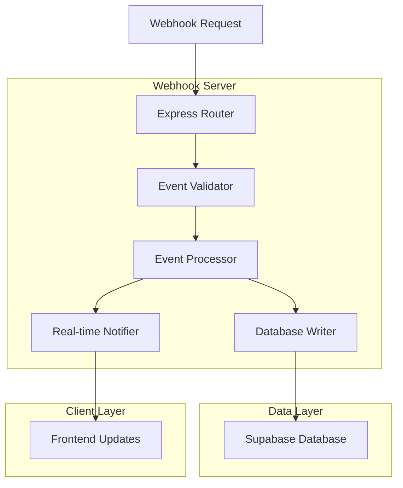
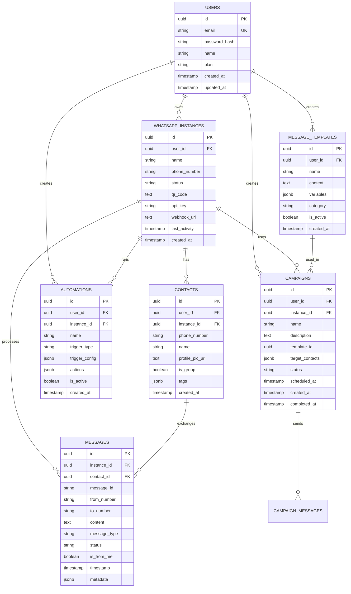
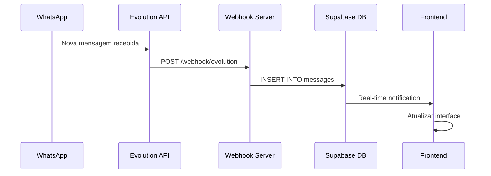
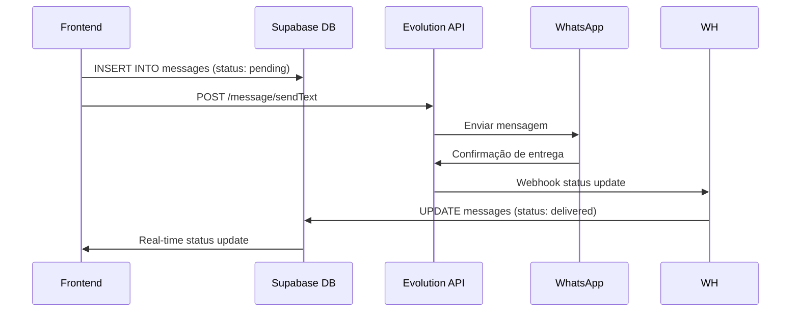

# Arquitetura Técnica - Sistema SaaS WhatsApp

## 1. Arquitetura Geral



## 2. Descrição das Tecnologias

- **Frontend**: React@18 + TypeScript + Tailwind CSS + shadcn/ui + Vite
- **Backend**: Supabase (PostgreSQL + Auth + Real-time)
- **Webhook Server**: Node.js + Express
- **External API**: Evolution API para WhatsApp Business
- **State Management**: React Hooks + Context API
- **Routing**: React Router DOM
- **UI Components**: shadcn/ui + Radix UI
- **Icons**: Lucide React
- **Charts**: Recharts
- **Date Handling**: date-fns

## 3. Definições de Rotas

| Rota | Propósito |
|------|-----------|
| / | Landing page - apresentação do produto |
| /login | Página de login - autenticação de usuários |
| /register | Página de registro - criação de contas |
| /dashboard | Dashboard principal - visão geral e métricas |
| /whatsapp/connections | Gerenciamento de conexões WhatsApp |
| /whatsapp/integration | Configuração de instâncias e webhooks |
| /messages | Interface de mensagens e conversas |
| /contacts | Gerenciamento de contatos e listas |
| /campaigns | Criação e gerenciamento de campanhas |
| /campaigns/create | Criador de campanhas |
| /templates | Modelos de mensagens |
| /analytics | Relatórios e análises detalhadas |
| /automation | Fluxos automatizados e chatbots |
| /automation/flow-builder | Construtor visual de fluxos |
| /scheduling | Agendamento de mensagens |
| /settings | Configurações do sistema e perfil |
| /support | Suporte ao cliente e documentação |
| /notifications | Central de notificações |
| /admin | Painel administrativo (Super Admin) |

## 4. APIs e Integrações

### 4.1 APIs Internas (Supabase)

#### Autenticação
```typescript
// Login
POST /auth/v1/token
Body: { email: string, password: string }
Response: { access_token: string, user: User }

// Registro
POST /auth/v1/signup
Body: { email: string, password: string, data: { name: string } }
Response: { user: User, session: Session }

// Logout
POST /auth/v1/logout
Headers: { Authorization: "Bearer <token>" }
Response: { success: boolean }
```

#### Gerenciamento de Instâncias WhatsApp
```typescript
// Listar instâncias
GET /rest/v1/whatsapp_instances
Headers: { Authorization: "Bearer <token>" }
Response: WhatsAppInstance[]

// Criar instância
POST /rest/v1/whatsapp_instances
Body: { name: string, phone_number: string }
Response: WhatsAppInstance

// Atualizar status da instância
PATCH /rest/v1/whatsapp_instances?id=eq.<id>
Body: { status: string, qr_code?: string }
Response: WhatsAppInstance
```

#### Gerenciamento de Contatos
```typescript
// Listar contatos
GET /rest/v1/contacts
Headers: { Authorization: "Bearer <token>" }
Response: Contact[]

// Criar contato
POST /rest/v1/contacts
Body: { phone_number: string, name: string, instance_id: string }
Response: Contact

// Atualizar contato
PATCH /rest/v1/contacts?id=eq.<id>
Body: { name?: string, tags?: string[] }
Response: Contact
```

#### Mensagens
```typescript
// Listar mensagens
GET /rest/v1/messages?instance_id=eq.<id>&order=timestamp.desc
Headers: { Authorization: "Bearer <token>" }
Response: Message[]

// Criar mensagem
POST /rest/v1/messages
Body: { 
  instance_id: string, 
  contact_id: string, 
  content: string, 
  message_type: string 
}
Response: Message
```

#### Campanhas
```typescript
// Listar campanhas
GET /rest/v1/campaigns
Headers: { Authorization: "Bearer <token>" }
Response: Campaign[]

// Criar campanha
POST /rest/v1/campaigns
Body: { 
  name: string, 
  description: string, 
  template_id: string, 
  target_contacts: string[] 
}
Response: Campaign

// Executar campanha
PATCH /rest/v1/campaigns?id=eq.<id>
Body: { status: "running" }
Response: Campaign
```

### 4.2 APIs Externas (Evolution API)

#### Gerenciamento de Instâncias
```typescript
// Criar instância
POST /instance/create
Headers: { apikey: string }
Body: { 
  instanceName: string, 
  token: string, 
  qrcode: boolean,
  webhookUrl: string 
}
Response: { instance: InstanceData }

// Conectar instância
GET /instance/connect/{instanceName}
Headers: { apikey: string }
Response: { qrcode: string, status: string }

// Status da instância
GET /instance/connectionState/{instanceName}
Headers: { apikey: string }
Response: { instance: string, state: string }
```

#### Envio de Mensagens
```typescript
// Enviar mensagem de texto
POST /message/sendText/{instanceName}
Headers: { apikey: string }
Body: { number: string, text: string }
Response: { key: MessageKey, status: string }

// Enviar mídia
POST /message/sendMedia/{instanceName}
Headers: { apikey: string }
Body: { 
  number: string, 
  mediatype: string, 
  media: string, 
  caption?: string 
}
Response: { key: MessageKey, status: string }
```

#### Contatos e Conversas
```typescript
// Buscar contatos
GET /chat/findContacts/{instanceName}
Headers: { apikey: string }
Response: Contact[]

// Buscar mensagens
POST /chat/findMessages/{instanceName}
Headers: { apikey: string }
Body: { where: { owner: string }, limit: number }
Response: Message[]
```

## 5. Arquitetura do Servidor Webhook



### 5.1 Estrutura do Servidor
```javascript
// webhook-server.js
const express = require('express');
const { createClient } = require('@supabase/supabase-js');

const app = express();
const supabase = createClient(
  process.env.SUPABASE_URL,
  process.env.SUPABASE_SERVICE_ROLE
);

// Middleware
app.use(express.json());
app.use(cors());

// Routes
app.post('/webhook/evolution', handleEvolutionWebhook);
app.get('/health', healthCheck);

// Event Handlers
async function handleEvolutionWebhook(req, res) {
  const { event, instance, data } = req.body;
  
  switch(event) {
    case 'messages.upsert':
      await handleMessageReceived(instance, data);
      break;
    case 'connection.update':
      await handleConnectionUpdate(instance, data);
      break;
    case 'qrcode.updated':
      await handleQRCodeUpdate(instance, data);
      break;
  }
  
  res.status(200).json({ success: true });
}
```

## 6. Modelo de Dados

### 6.1 Diagrama Entidade-Relacionamento



### 6.2 Scripts de Criação das Tabelas

```sql
-- Extensões necessárias
CREATE EXTENSION IF NOT EXISTS pgcrypto;

-- Tabela de usuários
CREATE TABLE users (
    id UUID PRIMARY KEY DEFAULT gen_random_uuid(),
    email VARCHAR(255) UNIQUE NOT NULL,
    password_hash VARCHAR(255),
    name VARCHAR(100) NOT NULL,
    plan VARCHAR(20) DEFAULT 'free' CHECK (plan IN ('free', 'basic', 'pro', 'enterprise')),
    created_at TIMESTAMP WITH TIME ZONE DEFAULT NOW(),
    updated_at TIMESTAMP WITH TIME ZONE DEFAULT NOW()
);

-- Tabela de instâncias WhatsApp
CREATE TABLE whatsapp_instances (
    id UUID PRIMARY KEY DEFAULT gen_random_uuid(),
    user_id UUID REFERENCES users(id) ON DELETE CASCADE,
    name VARCHAR(100) NOT NULL,
    phone_number VARCHAR(20),
    status VARCHAR(20) DEFAULT 'disconnected' CHECK (status IN ('connected', 'disconnected', 'connecting', 'error')),
    qr_code TEXT,
    api_key VARCHAR(255),
    webhook_url TEXT,
    last_activity TIMESTAMP WITH TIME ZONE,
    created_at TIMESTAMP WITH TIME ZONE DEFAULT NOW()
);

-- Tabela de contatos
CREATE TABLE contacts (
    id UUID PRIMARY KEY DEFAULT gen_random_uuid(),
    user_id UUID REFERENCES users(id) ON DELETE CASCADE,
    instance_id UUID REFERENCES whatsapp_instances(id) ON DELETE CASCADE,
    phone_number VARCHAR(20) NOT NULL,
    name VARCHAR(100),
    profile_pic_url TEXT,
    is_group BOOLEAN DEFAULT FALSE,
    tags JSONB DEFAULT '[]',
    created_at TIMESTAMP WITH TIME ZONE DEFAULT NOW(),
    UNIQUE(instance_id, phone_number)
);

-- Tabela de mensagens
CREATE TABLE messages (
    id UUID PRIMARY KEY DEFAULT gen_random_uuid(),
    instance_id UUID REFERENCES whatsapp_instances(id) ON DELETE CASCADE,
    contact_id UUID REFERENCES contacts(id) ON DELETE CASCADE,
    message_id VARCHAR(255),
    from_number VARCHAR(20) NOT NULL,
    to_number VARCHAR(20) NOT NULL,
    content TEXT NOT NULL,
    message_type VARCHAR(20) DEFAULT 'text' CHECK (message_type IN ('text', 'image', 'document', 'audio', 'video')),
    status VARCHAR(20) DEFAULT 'pending' CHECK (status IN ('pending', 'sent', 'delivered', 'read', 'failed')),
    is_from_me BOOLEAN DEFAULT FALSE,
    timestamp TIMESTAMP WITH TIME ZONE DEFAULT NOW(),
    metadata JSONB DEFAULT '{}'
);

-- Tabela de campanhas
CREATE TABLE campaigns (
    id UUID PRIMARY KEY DEFAULT gen_random_uuid(),
    user_id UUID REFERENCES users(id) ON DELETE CASCADE,
    instance_id UUID REFERENCES whatsapp_instances(id) ON DELETE CASCADE,
    name VARCHAR(100) NOT NULL,
    description TEXT,
    template_id UUID,
    target_contacts JSONB DEFAULT '[]',
    status VARCHAR(20) DEFAULT 'draft' CHECK (status IN ('draft', 'scheduled', 'running', 'completed', 'paused', 'cancelled')),
    scheduled_at TIMESTAMP WITH TIME ZONE,
    created_at TIMESTAMP WITH TIME ZONE DEFAULT NOW(),
    completed_at TIMESTAMP WITH TIME ZONE
);

-- Tabela de templates de mensagem
CREATE TABLE message_templates (
    id UUID PRIMARY KEY DEFAULT gen_random_uuid(),
    user_id UUID REFERENCES users(id) ON DELETE CASCADE,
    name VARCHAR(100) NOT NULL,
    content TEXT NOT NULL,
    variables JSONB DEFAULT '[]',
    category VARCHAR(50) DEFAULT 'marketing',
    is_active BOOLEAN DEFAULT TRUE,
    created_at TIMESTAMP WITH TIME ZONE DEFAULT NOW()
);

-- Tabela de automações
CREATE TABLE automations (
    id UUID PRIMARY KEY DEFAULT gen_random_uuid(),
    user_id UUID REFERENCES users(id) ON DELETE CASCADE,
    instance_id UUID REFERENCES whatsapp_instances(id) ON DELETE CASCADE,
    name VARCHAR(100) NOT NULL,
    trigger_type VARCHAR(50) NOT NULL,
    trigger_config JSONB DEFAULT '{}',
    actions JSONB DEFAULT '[]',
    is_active BOOLEAN DEFAULT TRUE,
    created_at TIMESTAMP WITH TIME ZONE DEFAULT NOW()
);

-- Índices para performance
CREATE INDEX idx_whatsapp_instances_user_id ON whatsapp_instances(user_id);
CREATE INDEX idx_contacts_instance_id ON contacts(instance_id);
CREATE INDEX idx_contacts_phone_number ON contacts(phone_number);
CREATE INDEX idx_messages_instance_id ON messages(instance_id);
CREATE INDEX idx_messages_contact_id ON messages(contact_id);
CREATE INDEX idx_messages_timestamp ON messages(timestamp DESC);
CREATE INDEX idx_campaigns_user_id ON campaigns(user_id);
CREATE INDEX idx_campaigns_status ON campaigns(status);
CREATE INDEX idx_message_templates_user_id ON message_templates(user_id);
CREATE INDEX idx_automations_instance_id ON automations(instance_id);

-- Habilitar Row Level Security
ALTER TABLE users ENABLE ROW LEVEL SECURITY;
ALTER TABLE whatsapp_instances ENABLE ROW LEVEL SECURITY;
ALTER TABLE contacts ENABLE ROW LEVEL SECURITY;
ALTER TABLE messages ENABLE ROW LEVEL SECURITY;
ALTER TABLE campaigns ENABLE ROW LEVEL SECURITY;
ALTER TABLE message_templates ENABLE ROW LEVEL SECURITY;
ALTER TABLE automations ENABLE ROW LEVEL SECURITY;

-- Políticas de segurança básicas
CREATE POLICY "Users can view own data" ON users FOR ALL USING (auth.uid() = id);
CREATE POLICY "Users can view own instances" ON whatsapp_instances FOR ALL USING (user_id = auth.uid());
CREATE POLICY "Users can view own contacts" ON contacts FOR ALL USING (user_id = auth.uid());
CREATE POLICY "Users can view own messages" ON messages FOR ALL USING (
    instance_id IN (SELECT id FROM whatsapp_instances WHERE user_id = auth.uid())
);
CREATE POLICY "Users can view own campaigns" ON campaigns FOR ALL USING (user_id = auth.uid());
CREATE POLICY "Users can view own templates" ON message_templates FOR ALL USING (user_id = auth.uid());
CREATE POLICY "Users can view own automations" ON automations FOR ALL USING (user_id = auth.uid());

-- Permissões para roles anônimos e autenticados
GRANT SELECT ON webhook_events TO anon;
GRANT ALL PRIVILEGES ON ALL TABLES IN SCHEMA public TO authenticated;
GRANT ALL PRIVILEGES ON ALL SEQUENCES IN SCHEMA public TO authenticated;
```

## 7. Fluxo de Dados em Tempo Real

### 7.1 Recebimento de Mensagens


### 7.2 Envio de Mensagens


## 8. Considerações de Segurança

### 8.1 Autenticação e Autorização
- **JWT Tokens**: Supabase Auth com refresh tokens
- **Row Level Security**: Políticas no banco de dados
- **API Keys**: Criptografadas no banco
- **Rate Limiting**: Proteção contra abuso

### 8.2 Validação de Dados
- **Input Sanitization**: Todos os inputs do usuário
- **Schema Validation**: Joi ou Zod para validação
- **SQL Injection**: Queries parametrizadas
- **XSS Protection**: Sanitização de conteúdo

### 8.3 Comunicação Segura
- **HTTPS**: Todas as comunicações
- **Webhook Signatures**: Validação de origem
- **CORS**: Configuração adequada
- **Environment Variables**: Credenciais seguras

## 9. Monitoramento e Logs

### 9.1 Health Checks
```javascript
// Health check endpoint
app.get('/health', (req, res) => {
  res.json({
    status: 'healthy',
    timestamp: new Date().toISOString(),
    services: {
      database: 'connected',
      evolutionApi: 'connected',
      webhook: 'active'
    }
  });
});
```

### 9.2 Logging
- **Structured Logs**: JSON format
- **Log Levels**: Error, Warn, Info, Debug
- **Request Tracking**: Unique request IDs
- **Performance Metrics**: Response times

### 9.3 Error Handling
- **Global Error Handler**: Express middleware
- **Graceful Degradation**: Fallback mechanisms
- **User Notifications**: Friendly error messages
- **Retry Logic**: Automatic retry for failed operations

---

*Esta arquitetura técnica fornece a base sólida para implementar todas as funcionalidades do sistema SaaS WhatsApp de forma escalável e segura.*