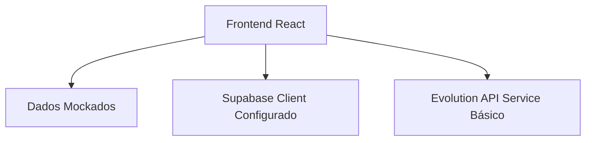
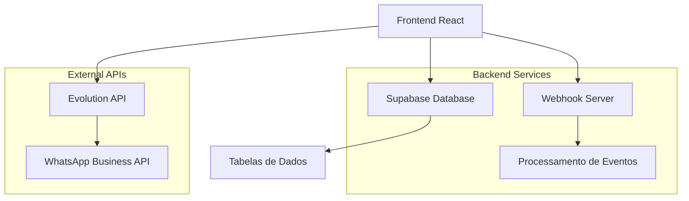

# Requisitos Técnicos para Implementação - Sistema SaaS WhatsApp

## 1. Visão Geral do Projeto

O sistema SaaS WhatsApp atualmente possui apenas o frontend desenvolvido com dados mockados. Este documento define os requisitos técnicos para transformar o sistema em uma aplicação funcional completa, integrando banco de dados real, API Evolution para WhatsApp, sistema de webhooks e autenticação robusta.

## 2. Funcionalidades Principais Identificadas

### 2.1 Páginas Existentes (Frontend)
- **Landing Page**: Página inicial com apresentação do produto
- **Login/Register**: Autenticação de usuários (atualmente mockada)
- **Dashboard**: Painel principal com métricas e visão geral
- **WhatsApp Connections**: Gerenciamento de conexões WhatsApp
- **WhatsApp Integration**: Configuração de instâncias e webhooks
- **Messages**: Interface de mensagens
- **Contacts**: Gerenciamento de contatos
- **Campaigns**: Criação e gerenciamento de campanhas
- **Templates**: Modelos de mensagens
- **Analytics**: Relatórios e análises
- **Automation**: Fluxos automatizados
- **Settings**: Configurações do sistema
- **Support**: Suporte ao cliente

### 2.2 Componentes e Serviços Existentes
- **useAuth Hook**: Sistema de autenticação (parcialmente implementado)
- **Evolution API Service**: Serviço para integração com API Evolution
- **Webhook Service**: Processamento de webhooks
- **Supabase Client**: Cliente configurado para banco de dados

## 3. Arquitetura Técnica Atual vs. Necessária

### 3.1 Arquitetura Atual


### 3.2 Arquitetura Necessária


## 4. Implementações Necessárias

### 4.1 Banco de Dados (Supabase)

#### 4.1.1 Tabelas Principais
```sql
-- Usuários
CREATE TABLE users (
    id UUID PRIMARY KEY DEFAULT gen_random_uuid(),
    email VARCHAR(255) UNIQUE NOT NULL,
    password_hash VARCHAR(255),
    name VARCHAR(100) NOT NULL,
    plan VARCHAR(20) DEFAULT 'free' CHECK (plan IN ('free', 'basic', 'pro', 'enterprise')),
    created_at TIMESTAMP WITH TIME ZONE DEFAULT NOW(),
    updated_at TIMESTAMP WITH TIME ZONE DEFAULT NOW()
);

-- Instâncias WhatsApp
CREATE TABLE whatsapp_instances (
    id UUID PRIMARY KEY DEFAULT gen_random_uuid(),
    user_id UUID REFERENCES users(id) ON DELETE CASCADE,
    name VARCHAR(100) NOT NULL,
    phone_number VARCHAR(20),
    status VARCHAR(20) DEFAULT 'disconnected' CHECK (status IN ('connected', 'disconnected', 'connecting', 'error')),
    qr_code TEXT,
    api_key VARCHAR(255),
    webhook_url TEXT,
    last_activity TIMESTAMP WITH TIME ZONE,
    created_at TIMESTAMP WITH TIME ZONE DEFAULT NOW()
);

-- Contatos
CREATE TABLE contacts (
    id UUID PRIMARY KEY DEFAULT gen_random_uuid(),
    user_id UUID REFERENCES users(id) ON DELETE CASCADE,
    instance_id UUID REFERENCES whatsapp_instances(id) ON DELETE CASCADE,
    phone_number VARCHAR(20) NOT NULL,
    name VARCHAR(100),
    profile_pic_url TEXT,
    is_group BOOLEAN DEFAULT FALSE,
    tags JSONB DEFAULT '[]',
    created_at TIMESTAMP WITH TIME ZONE DEFAULT NOW()
);

-- Mensagens
CREATE TABLE messages (
    id UUID PRIMARY KEY DEFAULT gen_random_uuid(),
    instance_id UUID REFERENCES whatsapp_instances(id) ON DELETE CASCADE,
    contact_id UUID REFERENCES contacts(id) ON DELETE CASCADE,
    message_id VARCHAR(255),
    from_number VARCHAR(20) NOT NULL,
    to_number VARCHAR(20) NOT NULL,
    content TEXT NOT NULL,
    message_type VARCHAR(20) DEFAULT 'text' CHECK (message_type IN ('text', 'image', 'document', 'audio', 'video')),
    status VARCHAR(20) DEFAULT 'pending' CHECK (status IN ('pending', 'sent', 'delivered', 'read', 'failed')),
    is_from_me BOOLEAN DEFAULT FALSE,
    timestamp TIMESTAMP WITH TIME ZONE DEFAULT NOW(),
    metadata JSONB DEFAULT '{}'
);

-- Campanhas
CREATE TABLE campaigns (
    id UUID PRIMARY KEY DEFAULT gen_random_uuid(),
    user_id UUID REFERENCES users(id) ON DELETE CASCADE,
    instance_id UUID REFERENCES whatsapp_instances(id) ON DELETE CASCADE,
    name VARCHAR(100) NOT NULL,
    description TEXT,
    template_id UUID,
    target_contacts JSONB DEFAULT '[]',
    status VARCHAR(20) DEFAULT 'draft' CHECK (status IN ('draft', 'scheduled', 'running', 'completed', 'paused', 'cancelled')),
    scheduled_at TIMESTAMP WITH TIME ZONE,
    created_at TIMESTAMP WITH TIME ZONE DEFAULT NOW(),
    completed_at TIMESTAMP WITH TIME ZONE
);

-- Templates de Mensagem
CREATE TABLE message_templates (
    id UUID PRIMARY KEY DEFAULT gen_random_uuid(),
    user_id UUID REFERENCES users(id) ON DELETE CASCADE,
    name VARCHAR(100) NOT NULL,
    content TEXT NOT NULL,
    variables JSONB DEFAULT '[]',
    category VARCHAR(50) DEFAULT 'marketing',
    is_active BOOLEAN DEFAULT TRUE,
    created_at TIMESTAMP WITH TIME ZONE DEFAULT NOW()
);

-- Automações
CREATE TABLE automations (
    id UUID PRIMARY KEY DEFAULT gen_random_uuid(),
    user_id UUID REFERENCES users(id) ON DELETE CASCADE,
    instance_id UUID REFERENCES whatsapp_instances(id) ON DELETE CASCADE,
    name VARCHAR(100) NOT NULL,
    trigger_type VARCHAR(50) NOT NULL,
    trigger_config JSONB DEFAULT '{}',
    actions JSONB DEFAULT '[]',
    is_active BOOLEAN DEFAULT TRUE,
    created_at TIMESTAMP WITH TIME ZONE DEFAULT NOW()
);

-- Webhooks (já existe)
-- webhook_events table já está criada no setup.sql
```

#### 4.1.2 Políticas de Segurança (RLS)
```sql
-- Habilitar RLS para todas as tabelas
ALTER TABLE users ENABLE ROW LEVEL SECURITY;
ALTER TABLE whatsapp_instances ENABLE ROW LEVEL SECURITY;
ALTER TABLE contacts ENABLE ROW LEVEL SECURITY;
ALTER TABLE messages ENABLE ROW LEVEL SECURITY;
ALTER TABLE campaigns ENABLE ROW LEVEL SECURITY;
ALTER TABLE message_templates ENABLE ROW LEVEL SECURITY;
ALTER TABLE automations ENABLE ROW LEVEL SECURITY;

-- Políticas básicas (usuários só veem seus próprios dados)
CREATE POLICY "Users can view own data" ON users FOR ALL USING (auth.uid() = id);
CREATE POLICY "Users can view own instances" ON whatsapp_instances FOR ALL USING (user_id = auth.uid());
CREATE POLICY "Users can view own contacts" ON contacts FOR ALL USING (user_id = auth.uid());
-- ... (políticas similares para outras tabelas)
```

### 4.2 Autenticação Real

#### 4.2.1 Implementações Necessárias
- **Registro de usuários**: Integrar com Supabase Auth
- **Login/Logout**: Substituir sistema mockado
- **Recuperação de senha**: Implementar fluxo completo
- **Perfis de usuário**: Gerenciamento de dados do usuário
- **Planos e permissões**: Sistema de assinaturas

#### 4.2.2 Melhorias no useAuth Hook
```typescript
// Adicionar funcionalidades:
- register(email, password, name)
- resetPassword(email)
- updateProfile(userData)
- checkSubscription()
- upgradeSubscription(plan)
```

### 4.3 Integração Evolution API

#### 4.3.1 Funcionalidades a Implementar
- **Gerenciamento de instâncias**: Criar, conectar, desconectar
- **QR Code em tempo real**: WebSocket ou polling
- **Envio de mensagens**: Texto, mídia, documentos
- **Recebimento de mensagens**: Via webhooks
- **Sincronização de contatos**: Automática
- **Status de entrega**: Tracking completo

#### 4.3.2 Melhorias no Service
```typescript
// Adicionar métodos:
- getQRCodeRealTime()
- syncContacts()
- handleWebhookEvent(event)
- getMessageStatus(messageId)
- bulkSendMessages(messages)
```

### 4.4 Sistema de Webhooks

#### 4.4.1 Eventos a Processar
- **Mensagens recebidas**: Armazenar no banco
- **Status de mensagens**: Atualizar delivery status
- **Conexão/Desconexão**: Atualizar status da instância
- **QR Code atualizado**: Notificar frontend
- **Contatos novos**: Sincronizar automaticamente

#### 4.4.2 Servidor Webhook (Melhorias)
```javascript
// Adicionar handlers:
- handleMessageReceived(data)
- handleMessageStatus(data)
- handleInstanceStatus(data)
- handleQRCodeUpdate(data)
- handleContactSync(data)
```

### 4.5 Funcionalidades de Negócio

#### 4.5.1 Gerenciamento de Contatos
- **Importação**: CSV, Excel, API
- **Segmentação**: Tags, grupos, filtros
- **Sincronização**: WhatsApp ↔ Sistema
- **Histórico**: Todas as interações

#### 4.5.2 Campanhas de Marketing
- **Criação**: Interface drag-and-drop
- **Agendamento**: Data/hora específica
- **Segmentação**: Público-alvo
- **Métricas**: Entrega, abertura, resposta

#### 4.5.3 Templates de Mensagem
- **Criação**: Editor rico
- **Variáveis**: Personalização dinâmica
- **Categorias**: Organização
- **Aprovação**: WhatsApp Business API

#### 4.5.4 Automações
- **Triggers**: Palavra-chave, horário, evento
- **Ações**: Enviar mensagem, adicionar tag, transferir
- **Fluxos**: Sequências complexas
- **Condições**: Lógica condicional

#### 4.5.5 Analytics e Relatórios
- **Métricas em tempo real**: Dashboard
- **Relatórios**: Exportação PDF/Excel
- **Gráficos**: Visualização de dados
- **Comparativos**: Períodos, campanhas

## 5. Priorização de Implementação

### 5.1 Fase 1 - Fundação (Crítica)
1. **Banco de dados**: Criar todas as tabelas
2. **Autenticação real**: Supabase Auth
3. **Conexão WhatsApp**: Instâncias básicas
4. **Webhooks**: Recebimento de mensagens

### 5.2 Fase 2 - Core Features (Alta)
1. **Envio de mensagens**: Interface completa
2. **Gerenciamento de contatos**: CRUD completo
3. **Templates básicos**: Criação e uso
4. **Dashboard**: Métricas reais

### 5.3 Fase 3 - Avançado (Média)
1. **Campanhas**: Sistema completo
2. **Automações**: Fluxos básicos
3. **Analytics**: Relatórios detalhados
4. **Integrações**: APIs externas

### 5.4 Fase 4 - Otimização (Baixa)
1. **Performance**: Otimizações
2. **Escalabilidade**: Melhorias
3. **Features avançadas**: IA, chatbots
4. **Mobile**: App nativo

## 6. Considerações Técnicas

### 6.1 Performance
- **Paginação**: Listas grandes
- **Cache**: Redis para dados frequentes
- **Otimização**: Queries do banco
- **CDN**: Assets estáticos

### 6.2 Segurança
- **Validação**: Input sanitization
- **Rate limiting**: APIs
- **Logs**: Auditoria completa
- **Backup**: Dados críticos

### 6.3 Monitoramento
- **Health checks**: Serviços
- **Alertas**: Falhas críticas
- **Métricas**: Performance
- **Logs**: Centralizados

## 7. Estimativa de Desenvolvimento

### 7.1 Recursos Necessários
- **1 Desenvolvedor Full-Stack**: 3-4 meses
- **1 Desenvolvedor Backend**: 2-3 meses (paralelo)
- **1 Designer/UX**: 1 mês (melhorias)

### 7.2 Timeline Sugerido
- **Semana 1-2**: Setup banco + Auth
- **Semana 3-4**: WhatsApp Integration
- **Semana 5-6**: Mensagens + Contatos
- **Semana 7-8**: Templates + Campanhas
- **Semana 9-10**: Automações + Analytics
- **Semana 11-12**: Testes + Deploy

## 8. Próximos Passos

1. **Aprovação**: Revisar e aprovar requisitos
2. **Setup**: Configurar ambiente de desenvolvimento
3. **Banco**: Executar scripts de criação
4. **Desenvolvimento**: Iniciar Fase 1
5. **Testes**: Validação contínua
6. **Deploy**: Ambiente de produção

---

*Este documento serve como guia técnico para transformar o sistema SaaS WhatsApp de um protótipo com dados mockados em uma aplicação funcional completa.*