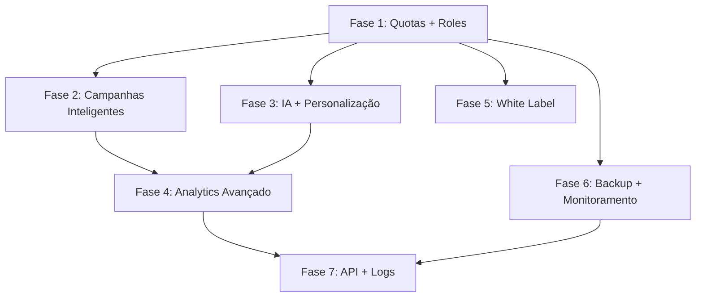

# 🗺️ Roadmap de Implementação - Funcionalidades Astra Campaign

## 📋 Visão Geral

Este roadmap detalha a implementação de todas as funcionalidades avançadas do **Astra Campaign** no sistema **WhatsApp SaaS** atual, mantendo o layout e estrutura existente.

### 🎯 Objetivo
Copiar toda a lógica e funcionalidades que já funcionam no Astra Campaign, preservando:
- ✅ Layout atual (shadcn/ui + Tailwind)
- ✅ Estrutura de componentes existente
- ✅ Multi-tenancy já implementado
- ✅ Autenticação Supabase
- ✅ Integração Evolution API

---

## 🔍 Análise Comparativa

### **Sistema Atual (WhatsApp SaaS)**
✅ **Já implementado:**
- Multi-tenancy básico (tabelas, RLS, SuperAdmin)
- Autenticação Supabase
- Conexões WhatsApp (Evolution API)
- Interface moderna com shadcn/ui
- Estrutura de campanhas básica
- Sistema de contatos
- Templates de mensagem
- Páginas: Dashboard, Contatos, Campanhas, Analytics, etc.

### **Sistema Astra Campaign**
🎯 **Funcionalidades avançadas a implementar:**
- Sistema de quotas avançado com alertas
- Backup & Restore automatizado
- IA integrada (OpenAI/Groq)
- Sistema de randomização inteligente
- Multi-sessão com failover
- Analytics completo com exportação
- White Label personalização
- Sistema de roles completo
- Campanhas sequenciais complexas
- Rate limiting inteligente
- Sistema de alertas e monitoramento

---

## 🚀 ROADMAP DE IMPLEMENTAÇÃO

### **FASE 1: Fundação e Estrutura (Semana 1-2)**
*Prioridade: CRÍTICA*

#### 1.1 Sistema de Quotas Avançado
**Arquivos a criar/modificar:**
```
src/hooks/useQuotas.ts
src/components/ui/quota-progress.tsx
src/components/ui/quota-alert.tsx
src/pages/QuotaManagement.tsx
supabase/migrations/add_quota_system.sql
```

**Funcionalidades:**
- Controle de limites por tenant (usuários, contatos, campanhas, conexões)
- Alertas automáticos (85% e 100% de uso)
- Interface visual de progresso
- Bloqueio automático ao atingir limites
- Mensagens amigáveis para upgrade

**Dependências:** Multi-tenant já implementado

#### 1.2 Sistema de Roles Completo
**Arquivos a criar/modificar:**
```
src/hooks/useRoles.ts
src/components/auth/RoleGuard.tsx
src/contexts/RoleContext.tsx
supabase/migrations/enhance_roles_system.sql
```

**Funcionalidades:**
- SUPERADMIN: Gerencia todos os tenants
- ADMIN: Gerencia seu tenant
- USER: Acesso limitado
- Controle de acesso granular por funcionalidade
- Interface de gerenciamento de permissões

**Dependências:** Sistema atual de auth

---

### **FASE 2: Campanhas Inteligentes (Semana 3-4)**
*Prioridade: ALTA*

#### 2.1 Sistema de Randomização
**Arquivos a criar/modificar:**
```
src/services/randomizationService.ts
src/components/campaign/RandomizationConfig.tsx
src/components/campaign/MediaPool.tsx
src/hooks/useRandomization.ts
```

**Funcionalidades:**
- Pool de textos aleatórios
- Pool de imagens/vídeos/arquivos
- Legendas variadas para mídia
- Humanização de envios
- Preview em tempo real

#### 2.2 Campanhas Sequenciais
**Arquivos a criar/modificar:**
```
src/components/campaign/SequenceBuilder.tsx
src/services/campaignSequenceService.ts
src/hooks/useCampaignSequence.ts
```

**Funcionalidades:**
- Múltiplas mensagens em ordem
- Delays configuráveis entre mensagens
- Condições de parada
- Controles: pausar, retomar, cancelar
- Timeline visual de execução

#### 2.3 Multi-Sessão com Failover
**Arquivos a criar/modificar:**
```
src/services/sessionManagerService.ts
src/hooks/useSessionManager.ts
src/components/whatsapp/SessionDistribution.tsx
```

**Funcionalidades:**
- Distribuição automática entre conexões
- Failover automático em falhas
- Balanceamento de carga
- Monitoramento de saúde das sessões
- Reconnect automático

**Dependências:** Sistema de conexões WhatsApp existente

---

### **FASE 3: IA e Personalização (Semana 5-6)**
*Prioridade: ALTA*

#### 3.1 Integração IA (OpenAI/Groq)
**Arquivos a criar/modificar:**
```
src/services/aiService.ts
src/components/campaign/AIPersonalization.tsx
src/hooks/useAI.ts
src/components/ui/ai-config.tsx
```

**Funcionalidades:**
- Personalização automática de mensagens
- Integração OpenAI e Groq
- Configuração de chaves API por tenant
- Templates de prompts
- Preview de mensagens geradas

#### 3.2 Variáveis Dinâmicas Avançadas
**Arquivos a criar/modificar:**
```
src/services/variableService.ts
src/components/campaign/VariableManager.tsx
src/utils/templateProcessor.ts
```

**Funcionalidades:**
- {{nome}}, {{telefone}}, {{email}}, {{categoria}}, {{observacoes}}
- Variáveis customizadas por tenant
- Processamento em tempo real
- Validação de variáveis
- Editor visual de templates

**Dependências:** Sistema de contatos existente

---

### **FASE 4: Analytics e Relatórios (Semana 7-8)**
*Prioridade: MÉDIA*

#### 4.1 Analytics Completo
**Arquivos a criar/modificar:**
```
src/pages/AdvancedAnalytics.tsx
src/services/analyticsService.ts
src/components/analytics/DetailedCharts.tsx
src/hooks/useAdvancedAnalytics.ts
```

**Funcionalidades:**
- Dashboard em tempo real
- Estatísticas detalhadas (enviadas, falharam, pendentes)
- Distribuição por sessão WhatsApp
- Análise de erros categorizada
- Timeline de execução
- Métricas por tenant

#### 4.2 Exportação de Dados
**Arquivos a criar/modificar:**
```
src/services/exportService.ts
src/components/analytics/ExportTools.tsx
src/utils/csvExporter.ts
```

**Funcionalidades:**
- Exportação completa em CSV
- Relatórios personalizáveis
- Agendamento de relatórios
- Histórico de exportações
- Filtros avançados

**Dependências:** Sistema de analytics existente

---

### **FASE 5: White Label e Personalização (Semana 9-10)**
*Prioridade: MÉDIA*

#### 5.1 Sistema White Label
**Arquivos a criar/modificar:**
```
src/services/brandingService.ts
src/components/admin/BrandingConfig.tsx
src/hooks/useBranding.ts
src/contexts/BrandingContext.tsx
```

**Funcionalidades:**
- Logo personalizado por tenant
- Favicon customizado
- Cores da marca configuráveis
- Títulos e textos personalizáveis
- Preview em tempo real
- Aplicação automática no sistema

#### 5.2 Configurações Avançadas
**Arquivos a criar/modificar:**
```
src/pages/AdvancedSettings.tsx
src/components/settings/TenantConfig.tsx
src/services/configService.ts
```

**Funcionalidades:**
- Configurações globais (Super Admin)
- Configurações por tenant
- Integração WAHA/Evolution configurável
- Chaves de API por tenant
- Sistema de notificações

**Dependências:** Sistema de settings existente

---

### **FASE 6: Backup e Monitoramento (Semana 11-12)**
*Prioridade: BAIXA*

#### 6.1 Sistema de Backup & Restore
**Arquivos a criar/modificar:**
```
src/services/backupService.ts
src/pages/BackupManagement.tsx
src/components/backup/BackupScheduler.tsx
src/hooks/useBackup.ts
```

**Funcionalidades:**
- Backup automático agendado
- Backup manual sob demanda
- Restauração completa do banco
- Histórico de backups com metadados
- Interface de gerenciamento

#### 6.2 Sistema de Alertas e Monitoramento
**Arquivos a criar/modificar:**
```
src/services/monitoringService.ts
src/components/monitoring/AlertSystem.tsx
src/hooks/useMonitoring.ts
src/pages/SystemMonitoring.tsx
```

**Funcionalidades:**
- Alertas de quota (85% e 100%)
- Monitoramento de saúde do sistema
- Notificações em tempo real
- Dashboard de status
- Logs detalhados

**Dependências:** Sistema de quotas

---

### **FASE 7: API e Integrações (Semana 13-14)**
*Prioridade: BAIXA*

#### 7.1 API REST Completa
**Arquivos a criar/modificar:**
```
api/v1/tenants.ts
api/v1/campaigns.ts
api/v1/contacts.ts
api/v1/analytics.ts
src/services/apiClient.ts
```

**Funcionalidades:**
- Endpoints completos para todas as funcionalidades
- Autenticação JWT
- Rate limiting
- Documentação automática
- Webhooks para integrações

#### 7.2 Sistema de Logs Detalhado
**Arquivos a criar/modificar:**
```
src/services/loggingService.ts
src/components/logs/LogViewer.tsx
src/pages/SystemLogs.tsx
supabase/migrations/add_logging_system.sql
```

**Funcionalidades:**
- Logs detalhados de todas as operações
- Filtros avançados
- Busca em tempo real
- Exportação de logs
- Retenção configurável

---

## 📊 Cronograma Estimado

| Fase | Duração | Funcionalidades Principais | Status |
|------|---------|----------------------------|--------|
| **Fase 1** | 2 semanas | Quotas + Roles | 🔄 Planejado |
| **Fase 2** | 2 semanas | Campanhas Inteligentes | 🔄 Planejado |
| **Fase 3** | 2 semanas | IA + Personalização | 🔄 Planejado |
| **Fase 4** | 2 semanas | Analytics Avançado | 🔄 Planejado |
| **Fase 5** | 2 semanas | White Label | 🔄 Planejado |
| **Fase 6** | 2 semanas | Backup + Monitoramento | 🔄 Planejado |
| **Fase 7** | 2 semanas | API + Logs | 🔄 Planejado |

**Total estimado: 14 semanas (3,5 meses)**

---

## 🔗 Dependências Entre Fases



---

## 🎯 Critérios de Sucesso

### **Funcionalidades Críticas (Obrigatórias)**
- ✅ Sistema de quotas funcionando
- ✅ Campanhas com randomização
- ✅ Multi-sessão com failover
- ✅ IA integrada para personalização
- ✅ Analytics detalhado

### **Funcionalidades Importantes (Desejáveis)**
- ✅ White Label completo
- ✅ Backup automatizado
- ✅ Sistema de alertas
- ✅ API REST completa

### **Funcionalidades Opcionais (Nice-to-have)**
- ✅ Logs detalhados
- ✅ Monitoramento avançado
- ✅ Integrações externas

---

## 🛠️ Considerações Técnicas

### **Manter Compatibilidade**
- Layout atual (shadcn/ui + Tailwind)
- Estrutura de componentes existente
- Sistema de roteamento atual
- Integração Supabase existente

### **Melhorias de Performance**
- Lazy loading para componentes pesados
- Otimização de queries Supabase
- Cache inteligente para dados frequentes
- Paginação otimizada

### **Segurança**
- Validação rigorosa de inputs
- Sanitização de dados
- Rate limiting por tenant
- Logs de auditoria

---

## 📝 Próximos Passos

1. **Aprovação do Roadmap** - Revisar e aprovar as fases
2. **Setup do Ambiente** - Preparar ferramentas e dependências
3. **Início da Fase 1** - Implementar sistema de quotas
4. **Testes Contínuos** - Validar cada funcionalidade
5. **Deploy Incremental** - Liberar funcionalidades por fase

---

*Este roadmap garante que todas as funcionalidades avançadas do Astra Campaign sejam implementadas mantendo a qualidade e estrutura do sistema atual.*